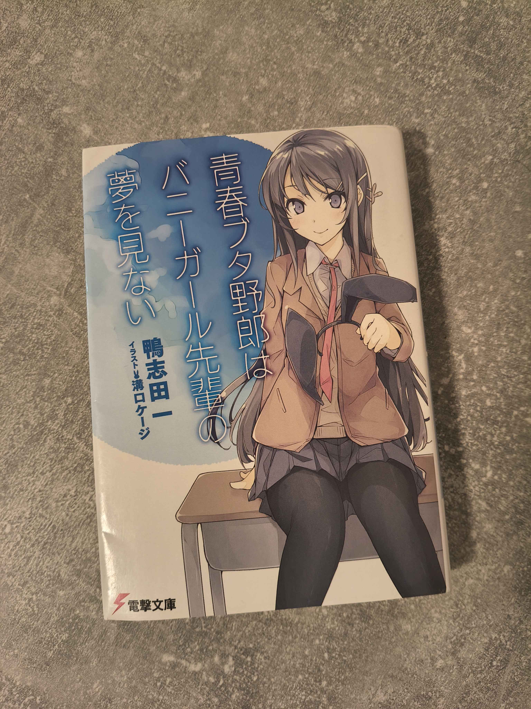

#+title: Reading my first Light Novel in Japanese
#+date: 2026-08-03
#+hugo_draft: false
#+hugo_base_dir: ../
#+hugo_section: posts
#+filetags: japanese

* The Traditional Route (And Its Limits)
For years, I dedicated varying amounts of time to learning Japanese: grinding through textbooks, watching grammar videos, and even attending a university course. While these resources certainly built a solid theoretical foundation, my progress always felt quite slow and, in a way, quite unnatural. Learning English as a second language when I was young had been completely effortless; I barely listened in class, skipped my homework, and still regularly aced my tests. Japanese, or at least my approach toward learning it, proved different though.

My first trip to Japan in 2025 served as a major reality check. While I was proud of the few interactions I somehow managed to stumble through, I was mostly humbled by the sheer amount of the language I simply couldn't comprehend. I knew something had to change. 

* The Immersion Paradigm
It was around this time that I discovered the immersion learning community. The core philosophy, learning almost exclusively by immersing yourself in native media with the help of software, immediately appealed to me as it mirrored how I learned English through media consumption in middle school. My main reference was [[https://learnjapanese.moe/][TheMoeWay]], which is not only one of the greatest resources to ever exist for Japanese learners, but a goldmine for anyone acquiring a new language.

I spent my first year mostly immersing in anime and manga, eventually reading through the entirety of the /よつばと!/ (Yotsuba&!) series (or at least all the volumes available at the time). By the time I visited Japan for a second time, I was genuinely impressed by the results. Manageable conversations now extended far beyond basic store and restaurant interactions. Even when it felt like I was fighting for my life, some spontaneous conversations at bars were suddenly doable (though the beer certainly helped, even if I hadn't known any Japanese!). Encouraged by this, I decided it was time to push my immersion beyond manga.

* Choosing the Medium: Why a Light Novel?
Within the immersion community, Visual Novels (VNs) are highly regarded as the perfect stepping stone. Because they are voiced and accompanied by imagery, they make it much easier to track the context, maintain good pronunciation, and push through challenging stretches of text. 

While I absolutely want to delve into VNs eventually, I decided against it for the time being. I can sometimes struggle to stay invested in a single, massive storyline for extended periods, which is a prerequisite for most VNs. Instead, I decided to take the plunge directly into a Light Novel. 

I specifically chose /青春ブタ野郎はバニーガール先輩の夢を見ない/ (Rascal Does Not Dream of Bunny Girl Senpai). I already loved the anime adaptation, and the story contains enough slice-of-life elements to remain somewhat approachable for a beginner. I had also bought a physical copy at a Book-Off in Japan (oh, how I miss that store...), and even though I was reading the digital version, having the physical book sitting on my desk served as a great motivator.

#+caption: Little idea did I have how long this little book would take me...
#+attr_html: :alt 青春ブタ野郎はバニーガール先輩の夢を見ない as a physical book :width 800px

* The Setup
I won't dive too deeply into the technicalities of my immersion setup here. [[https://learnjapanese.moe/][TheMoeWay]] does a far better job of explaining the mechanics than I ever could. 

However, my workflow is fairly standard: I read the LN using [[https://github.com/ttu-ttu/ebook-reader][ッツ Ebook Reader]]. Whenever I encounter an unknown word, I hover over it with [[https://yomitan.wiki/][Yomitan]] and instantly add it to my [[https://apps.ankiweb.net/][Anki]] deck. Over the course of reading this single novel, my Anki deck grew by over 1000 cards. Honestly, looking at that number alone already feels like a massive success.

* A Smooth Start in Tokyo
I began reading the novel while I was still in Japan. Expecting a rather rough start, I was surprised by how smoothly the first few pages went despite reading on my phone while crammed into the Tokyo Metro. 

This unexpected ease likely came down to a few factors. First, I was benefiting from the "external immersion" of traveling through Japan for three consecutive weeks at this point; my brain was already dialed into the language. Second, being on vacation gave me the mental clarity to fully focus on the text, which did wonders for both my reading comprehension and my general well-being. Finally, the first chapter is heavy on exposition, describing characters, settings, and relationships, which was structurally easier to parse. As an added bonus, the story takes place in Kanagawa Prefecture, where we had been taking frequent day trips. Reading about familiar locations made the experience incredibly rewarding.

* Hitting the Quantum Wall Back Home
After returning from Japan, my progress slowed noticeably. Part of this was the inevitable post-vacation slump and jetlag, but it was also driven by the story shifting into the main plot. The sudden influx of pseudo-science and quantum mechanics references caught me off-guard again and again. 

Still, I tried my best not to space out. My baseline goal was to always understand the rough gist of each sentence and maintain a solid grasp of the ongoing plot, which ended up working quite well even through the denser scientific explanations.

This routine continued for the following months. Sometimes I read daily; other times, only once a week. I am, of course, aware that reading every day would have drastically accelerated my progress, but life gets busy. To keep myself accountable, I set a personal rule: whenever I did sit down for a session, I had to read at least 1,500 characters.

* One Down, Many to Go
Starting in February, it took me until the end of July to finally finish the book. Given my irregular schedule, the timeline itself doesn't mean much. In raw numbers, however, it took me 35 hours and 39 minutes to read the entire Light Novel, which consisted of 110,201 characters.

My reading speed is definitely still quite slow, but I am incredibly glad to see how much it naturally improved from the prologue to the epilogue. The only thing left to decide now is what to read next. The second volume of the series would be the easiest pick, as it follows a familiar writing style, but there are plenty of other series I would love to read.

Either way, I’ve officially abandoned my reservations about Japanese novels being "too hard" for me, and I’m looking forward to continuing the journey.
