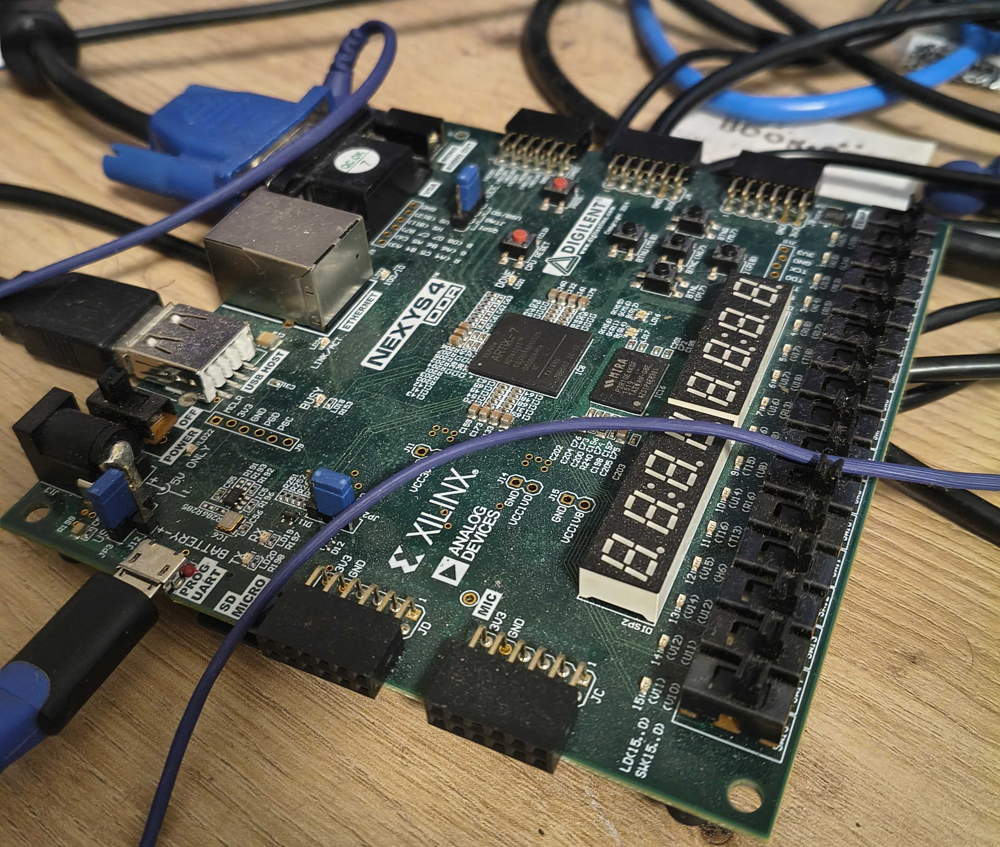
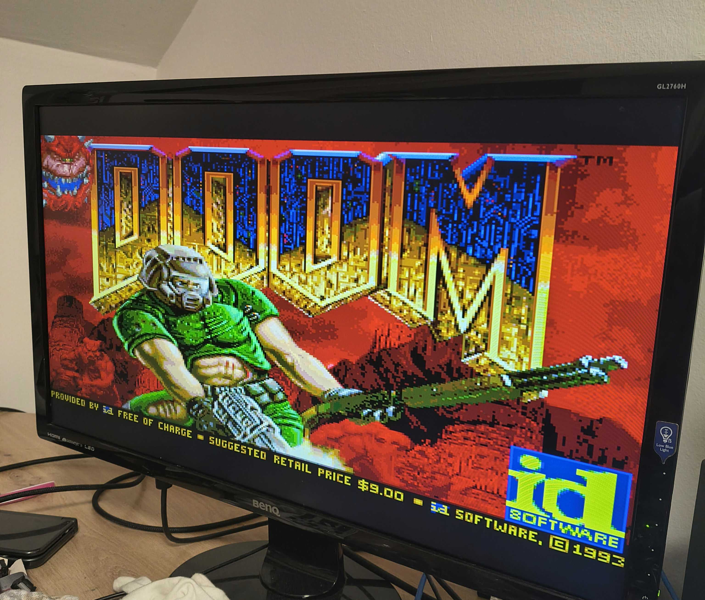

#+title: Project Tartarus: DOOM on RISC-V
#+date: 2026-07-31
#+hugo_draft: false
#+hugo_base_dir: ../
#+hugo_section: posts
#+filetags: riscv:fpga:hardware:embedded:verilog

*The most important question in computing: "But can it run DOOM?"*

As a Computer Science student whose background is primarily in software, hardware design always felt like a bit of a dark art. I knew how a CPU worked in theory from various courses, but dealing with gates, clock domains, and routing constraints not just on paper? That was somewhat new territory. 

My descent into hardware started during a university lab based on the excellent Open Educational Resource [[https://github.com/tscheipel/HaDes-V][HaDes-V]]. The goal was to guide hardware novices like myself through the process of building a pipelined 32-bit [[https://riscv.org/][RISC-V]] processor, eventually bringing it to life on the [[https://digilent.com/shop/basys-3-amd-artix-7-fpga-trainer-board-recommended-for-introductory-users/][Basys 3 FPGA Trainer Board]]. To my surprise, my base implementation worked (well, not on the first try, but testing, debugging and beer eventually solved any remaining issues). It ran C programs, pushed pixels to a VGA display, and handled basic =printf()= debugging over UART.

For the final phase of the lab, we were given free rein to implement custom extensions, such as cryptographic peripherals,  FPUs or audio controllers. Overeager and entirely naive to the realities of embedded hardware, I decided to ask the important question of running DOOM.

#+caption: The Nexys 4 DDR FPGA Development Board used for the project.
#+attr_html: :alt A Nexys 4 DDR Development Board with multiple wires connected. :width 800px

* The 4 MB Elephant

I quickly learned a harsh lesson about hardware: software assumptions do not apply here. I figured that since DOOM runs on literally anything with a screen and a Turing-complete chip, it would be possible, easily so in the timewindow for the project, which was about 2.5 weeks.
Wrong. 

The Shareware WAD file (the core game assets containing the levels, sprites, and sounds for DOOM) is about 4 MB. The Basys 3 board has exactly 256 KB of BRAM. 

Might be a bit tight huh.

After backing down to "just" implementing the DDR2 controller for the lab, the DOOM idea then rapidly escalated into a full-fledged seminar project. First things first, I had to ditch the Basys 3 and migrate the entire project to a much larger target. I ultimately went with the [[https://digilent.com/reference/programmable-logic/nexys-4-ddr/start][Nexys 4 DDR]], which gave me more logic, vastly more resources, and access to 128MB of DDR2 RAM  to easily hold the game data; Also it was available at my university to borrow, so I'm not going to act like that was some intricate design decision...

* Learning the Hard Way

I don't necessarily want to dive to deep into the technical details here, for that you can look at the documentation below, but still want to yell about the things that were challenging (and rewarding!):

- **The Math Problem:** DOOM relies heavily on 16.16 fixed-point arithmetic for its 3D rendering. Doing these multiplications in software meant the game would ran like a slideshow. Honestly, the multiplier and divider were quite easy to implement, especially since I already got used to working with DSP slices in another course in parallel. So these were nice to start with.
- **The "I Want to Go Home" Bootloader:** Initially, I was relying on a simple UART connection to load compiled binaries onto the board as provided in HaDes-V. That was fine for a 10 KB test binary, which would load in less than a second. But when the binary grew to include the DOOM engine and the WAD? Loading it took *almost an hour per attempt*. Iterating and debugging was impossible. Luckily the Nexys 4 DDR comes with an SD Card Reader. Adapting the bootloader to preferably load binaries from the SD Card, with the UART fallback remaining, was quite fun to do given it also makes presenting my work a lot easier. Theoretically, the bitfile could now be flashed, and software could be placed on the SD Card, to show the full project without the need for any second machine to attach over USB.
- **The Memory Wall:** Hooking up the external RAM meant wrestling with complex bus arbitrations and clock boundaries to give data fetches priority over instructions. But external RAM is incredibly slow compared to on-chip BRAM. The ~20-cycle latency (depending on access-pattern for DDR2) was crippling even the basic test-scripts from the lab. During ones studies, one of course learns a lot about caching. From principle, to funny timing attacks, they make up a central topic whenever you try to make something faster, or when something being faster leaks information. Compared to theoretical courses, where a lot is forgotten just months after the exam, designing and integrating my own  2-way set-associative cache subsystem definitely made sure I won't forget anything about the different cache designs there are, at least not anytime soon.
- **Faking an OS:** Because I had no operating system or filesystem (or runtime lol), I couldn't just read the WAD file from a disk. I linked the entire 4MB game file directly into the ELF binary using =objcopy= and hijacked the standard C file I/O functions (=fopen=, =fread=, =fseek=) to read from the embedded memory array instead. 
- **Hardware Framebuffers:** DOOM expects a single, unchanging screen to draw to. I had to completely rework the VGA controller to support double-buffering, and then build a hardware blitter. This allowed the hardware to rapidly copy the completed frame to the display behind the scenes while the game engine happily worked on the next one.

* Making it Playable

Using the [[https://github.com/ozkl/doomgeneric][doomgeneric]] port as a base abstraction layer, I wrote =hades_v_doom.c= to wire everything together. I mapped my custom PS/2 keyboard controller (complete with a hardware FIFO and watchdog timer for stuck keys), hooked up an 8-bit PWM audio mixer (for sound effects only, music would have melted the CPU at this point), and built a trap handler that dumped all 32 registers to my terminal whenever I crashed, which was often.

Debugging still posed a major limitation, as realistically, prints were the only real information I could extract at runtime. Implementing any standard debugging interface in hardware would have been another seminar project all on its own (though it definitely would be a great project for HaDes-V!). Unfortunately, this meant that some issues, such as those arising when attempting to turn on the =-O2= compiler flag, where the CPU ended up completely suck without a fault, were pretty much impossible to debug.

At 75 MHz, the processor is roughly equivalent to an old 486, but with a much simpler pipeline and no superscalar execution. Getting a playable framerate required me to rewrite DOOM's column rendering to use 32-bit bulk stores in memory. 

I also spent a ridiculous amount of time agonizing over GCC optimization flags. Turning on standard =-O2= caused silent hardware bugs that were a nightmare to debug as mentioned. I had to selectively profile the system using the =mcycle= CSR, eventually finding that flags like =-finline= and =-fbit-tests= gave me the speed I needed without breaking the pipeline.

#+caption: The feeling of first arriving at the iconic title screen...
#+attr_html: :alt The title screen of DOOM. :width 800px

* The Result
DOOM runs. At 10–30 FPS. With sound. On a CPU I built myself.

If you are curious about the raw technical architecture, memory bus layouts, and the exact Verilog implementation details, I wrote a =mdbook= documenting the entire system (which also includes a video showcase!):

[[https://tartarus.n0pl4c3.net][Technical Documentation]]

I am currently cleaning up the codebase to ensure it complies with all third-party licenses, and I hope to open-source the repository soon if my supervisor agrees to it.

# LocalWords: Tartarus UART cryptographic
